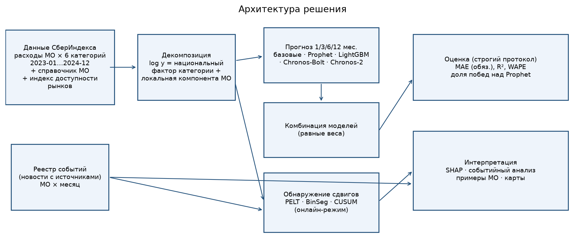

# sberindex-forecast-2026

**Прогноз потребления в муниципалитетах и раннее обнаружение шоков на данных СберИндекса**

Проект для онлайн-конкурса СберИндекса 2026, направление **«Прогнозирование»**.
Автор: **Владимир Матусевичус** (участвую один, команда «solo»).

> **Статус на 08.10.2026:** конкурсная версия готова. Данные СберИндекса загружены, бэктест на горизонтах 1/3/6/12 мес.
> проведён, итоговая модель сравнена с Prophet, детекторы шоков (PELT / BinSeg / CUSUM) сравнены между собой.
> Методологический отчёт: [`docs/methodology.md`](docs/methodology.md) и [`reports/methodology.pdf`](reports/methodology.pdf).
> Презентация: [`reports/presentation.pdf`](reports/presentation.pdf).

---

## Результаты

Тест: июль–декабрь 2024 г. Это 1 956 МО × 6 категорий = 11 736 рядов, 70 416 прогнозов на каждый горизонт.
Прогноз на месяц T строится только по данным до точки отсчёта T − h.
MAE указана в рублях на жителя в месяц, 95% ДИ — бутстреп по рядам.

| Горизонт | Prophet, MAE | **Итоговая модель**, MAE | Изменение MAE | 95% ДИ | R² Prophet / итог | Доля прогнозов, где итог точнее |
|---|---|---|---|---|---|---|
| 1 мес. | 640 | **332** | −48,1% | [−48,5; −47,8] | 0,990 / 0,997 | 77% |
| 3 мес. | 719 | **457** | −36,4% | [−36,8; −35,9] | 0,988 / 0,995 | 75% |
| 6 мес. | 736 | **587** | −20,3% | [−20,8; −19,9] | 0,988 / 0,992 | 64% |
| 12 мес. | 1 094 | **825** | −24,6% | [−26,0; −23,1] | 0,971 / 0,987 | 61% |

**Итоговая модель** — равновзвешенное среднее трёх моделей: LightGBM, гибрида Chronos-2 и Prophet.
На 12 мес. LightGBM без утечки не обучить, поэтому там усредняются только Chronos-2-гибрид и Prophet.
Состав комбинации выбран заранее на отдельной выборке из 60 МО, которая в оценку не входит.

Все модели, MAE по горизонтам 1 / 3 / 6 / 12 мес. ([`reports/results/metrics.csv`](reports/results/metrics.csv)):

| Модель | h=1 | h=3 | h=6 | h=12 |
|---|---|---|---|---|
| Prophet (база организаторов, настройки по умолчанию) | 640 | 719 | 736 | 1 094 |
| Наивная («как в прошлом месяце») | 624 | 864 | 1 125 | 1 289 |
| Сезонно-наивная («как год назад») | 1 289 | 1 289 | 1 289 | 1 289 |
| Сезонно-наивная + годовой рост | 341 | 454 | 655 | 1 289 |
| LightGBM (глобальная, прямая стратегия) | 305 | 531 | 781 | — |
| Chronos-Bolt, zero-shot по исходному ряду | 707 | 1 025 | 1 604 | 1 987 |
| Гибрид Chronos-2 (локальная компонента + национальный фактор) | 294 | 425 | 649 | 1 461 |
| LightGBM + Chronos-2 | **280** | **401** | 642 | 1 461 |
| **LightGBM + Chronos-2 + Prophet (итог)** | 332 | 457 | **587** | 825 |
| Наивная + Prophet | 579 | 759 | 843 | **808** |

На коротких горизонтах (1–3 мес.) лучшая модель — пара LightGBM + Chronos-2.
Итоговая комбинация с Prophet выбрана как самая устойчивая на всех горизонтах.
Она лучше Prophet во всех категориях на всех горизонтах, кроме одного случая: «Маркетплейсы» на 12 мес.

**Обнаружение структурных изменений** ([`reports/results/cpd_benchmark.csv`](reports/results/cpd_benchmark.csv)).
Бенчмарк: 1 000 реальных рядов, в половину из них вставлен сдвиг на 10–30%, режим онлайн.

| Метод | Обнаружено сдвигов | Средняя задержка, мес. | Ложные тревоги | F1 |
|---|---|---|---|---|
| PELT (штраф 8) | 74% | 1,34 | 28% | 0,62 |
| BinSeg (штраф 8) | 73% | 1,33 | 28% | 0,62 |
| CUSUM (порог 6) | 77% | 0,80 | 48% | 0,60 |
| CUSUM (порог 8) | 70% | 1,03 | 37% | 0,61 |

- PELT и BinSeg дают лучший баланс точности и полноты.
- Порог CUSUM 6 выбран ради раннего обнаружения: сдвиг замечается примерно на 0,5 мес. раньше, но ложных тревог больше.
- Проверка на реальном шоке, паводке апреля 2024 г.:
  - Звериноголовский МО Курганской обл.: «Все категории» −10% к январю–марту, «Здоровье» −29%. PELT/BinSeg датируют сдвиг апрелем 2024 г.
  - Подробности, а также осторожные выводы по Орску и Гаю — в отчёте.

## Данные

Только открытые данные, лицензия CC BY-SA 4.0. Подробности и схема — в [`data/README.md`](data/README.md).

| Источник | Что используется |
|---|---|
| [Архив данных конкурса СберИндекса](https://www.sberbank.com/common/img/uploaded/files/pdf/sberindex/hackathonlicence.zip) (ссылка со страницы конкурса) | `consumption.parquet`: безналичные расходы на жителя по МО и категориям, помесячно, 01.2023–12.2024 |
| [Справочник МО СберИндекса](https://www.sberbank.com/common/files/t_dict_municipal.rar) | названия МО и регионов, тип МО, координаты для карт |
| [`data/external/events.csv`](data/external/events.csv) | реестр событий (паводок 2024 г.) со ссылками на публикации РИА Новости, Интерфакса, Forbes и региональных СМИ |

Описание набора данных: [sberindex.ru — описание набора данных хакатона](https://sberindex.ru/ru/research/data-sense-opisanie-nabora-dannikh-khakatona-sberindeksa-po-munitsipalnim-dannim).

## Подход



- **Разложение:** log(расходы) = национальный фактор категории (медиана по МО: сезонность, инфляция) + локальная компонента МО.
- **Строгий протокол:** модель видит только данные до точки отсчёта, и в признаках, и при обучении. Это проверяется тестами.
- **Модели:**
  - наивные базовые модели и Prophet;
  - глобальный LightGBM: прямая стратегия, отдельная модель на горизонт, цель — log-прирост к точке отсчёта, разбор через SHAP;
  - Chronos-Bolt zero-shot;
  - гибрид Chronos-2 на локальной компоненте;
  - равновзвешенные комбинации.
- **Шоки:** PELT и BinSeg (`ruptures`), двусторонний CUSUM. Сравнение:
  - на полусинтетическом бенчмарке: доля обнаруженных сдвигов, задержка, ложные тревоги, F1;
  - на реальных данных по всем МО.
- **Новости:** реестр событий с источниками, привязанный к МО (`territory_id`) и месяцу. В момент o доступны только события до o (`news.event_matrix`). Event study по паводку 2024 г.

## Структура репозитория

```
├── configs/default.yaml          # пути, протокол, гиперпараметры моделей и детекторов
├── data/                         # data/raw — скачивается get_data.sh (не в git); data/external/events.csv — реестр событий
├── docs/methodology.md           # методологический отчёт
├── reports/
│   ├── methodology.pdf, presentation.pdf
│   ├── figures/                  # графики
│   └── results/                  # таблицы метрик и результатов
├── scripts/
│   ├── get_data.sh               # загрузка открытых данных
│   ├── run_backtest.py           # бэктест всех моделей на 1/3/6/12 мес.
│   ├── compare_vs_prophet.py     # бутстреп-сравнение с Prophet
│   ├── run_changepoints.py       # бенчмарк и реальный поиск сдвигов
│   ├── run_events.py             # разбор событий (паводок 2024)
│   ├── make_figures.py           # графики
│   └── build_pdfs.py             # PDF отчёта и презентации
├── src/sberindex_forecast/
│   ├── data.py  evaluation.py  changepoints.py  news.py  pipeline.py  config.py
│   └── models/  baselines.py (наивные, Prophet)  gbm.py (LightGBM + SHAP)  foundation.py (Chronos)
└── tests/test_smoke.py           # тесты: отсутствие утечки будущего, бэктест, детекторы, события
```

## Как воспроизвести

```bash
git clone https://github.com/oqoxucufawo66-spec/sberindex-forecast-2026.git
cd sberindex-forecast-2026
python -m venv .venv && source .venv/bin/activate
pip install -r requirements.txt
pip install -r requirements-fm.txt         # torch (CPU) + chronos-forecasting, для Chronos

bash scripts/get_data.sh                   # данные в data/raw/ (нужны curl и unar или 7z)
python scripts/run_backtest.py             # все модели, все МО
python scripts/run_backtest.py --sample 100 --models naive snaive_growth prophet lightgbm   # быстрый прогон
python scripts/compare_vs_prophet.py
python scripts/run_changepoints.py
python scripts/run_events.py
python scripts/make_figures.py
python scripts/build_pdfs.py               # нужен Chrome/Chromium
pytest -q
```

Все параметры задаются в [`configs/default.yaml`](configs/default.yaml).

## План работ

- [x] **03.10**: заявка на конкурс, создание репозитория
- [x] **08.10**: исследование условий конкурса, структура проекта, YAML-конфиг, каркас модулей
- [x] **08.10**: загрузка реальных данных СберИндекса и справочника МО, строгий протокол оценки
- [x] **08.10**: базовые модели и Prophet; LightGBM + SHAP; Chronos-Bolt и гибрид Chronos-2; комбинации; бэктест на 1/3/6/12 мес.
- [x] **08.10**: сравнение PELT / BinSeg / CUSUM (бенчмарк и реальные данные), реестр событий, разбор паводка 2024 г.
- [x] **08.10**: графики, карта, методологический отчёт и презентация (PDF), тесты
- [ ] **09.10**: финальная проверка воспроизводимости; срок подачи работ

### Дальнейшее развитие (после конкурсного срока)

- Новости: автоматический сбор лент, привязка к МО по топонимам, новостные признаки, абляция «с новостями / без».
- Дообучение Chronos-2 на рядах СберИндекса; ковариаты: календарь, доступность рынков (`market_access`), связи МО (`connection`).
- Локальная сезонность МО по мере накопления истории; проверка на нескольких тестовых периодах.
- Вероятностные прогнозы, пороги тревог по квантилям, BOCPD.
- Учёт преобразований МО (объединения и разделения) при склейке рядов.

## Автор

Владимир Матусевичус — Python-разработчик, анализ данных.
